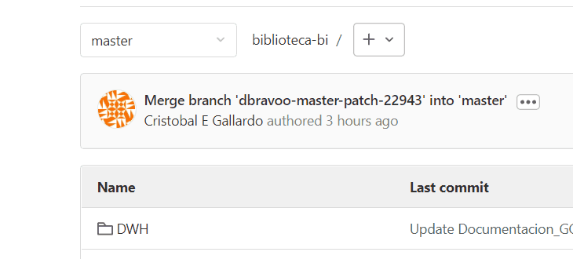
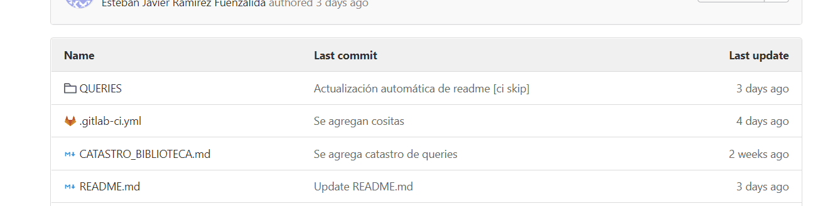
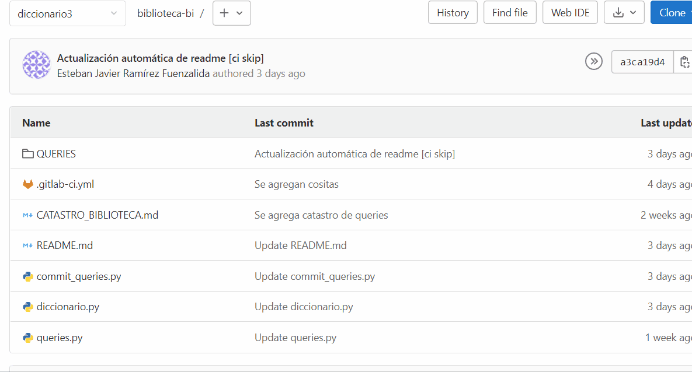
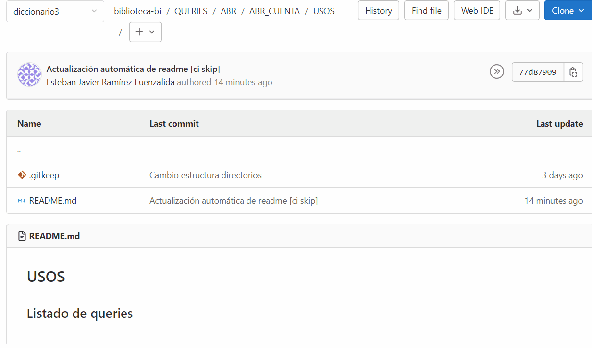
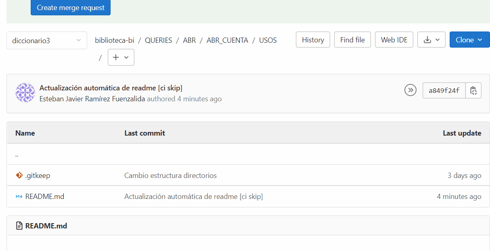
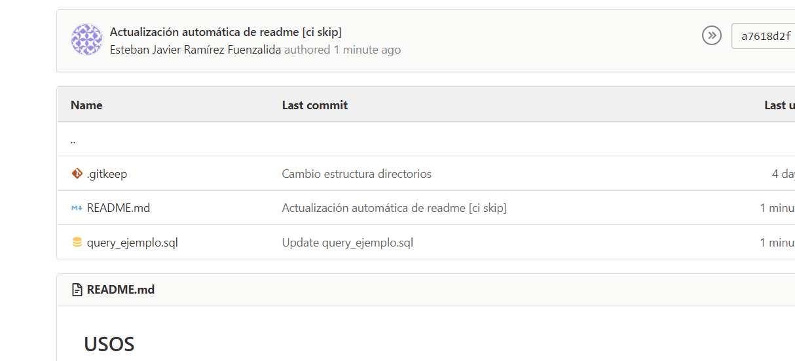
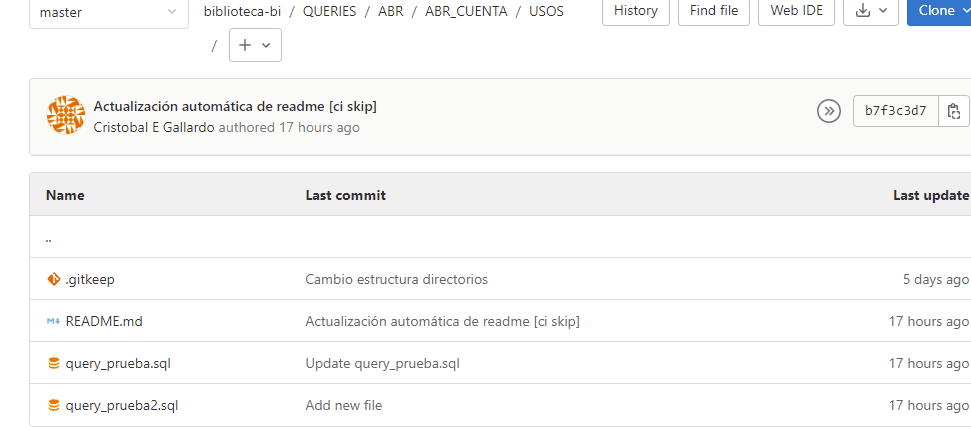
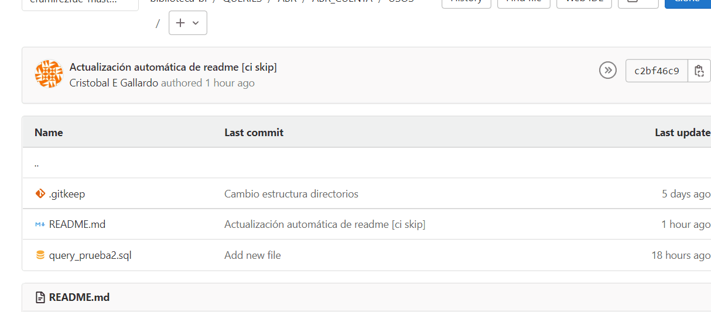
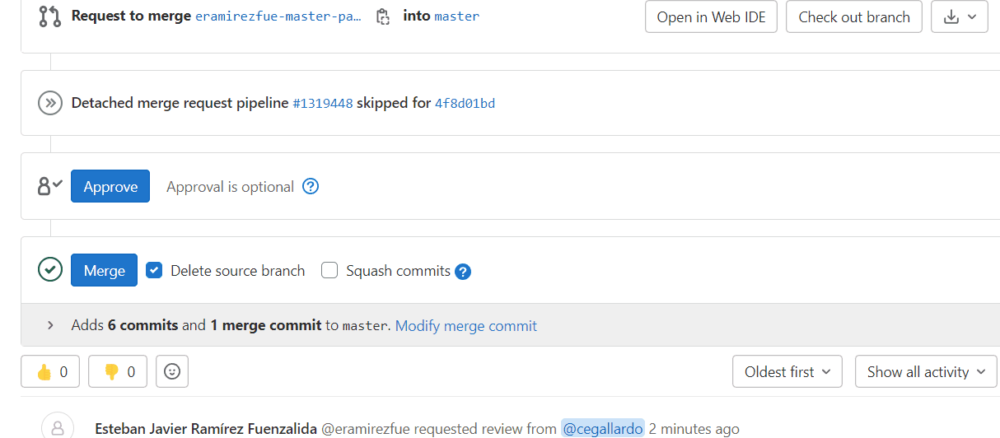
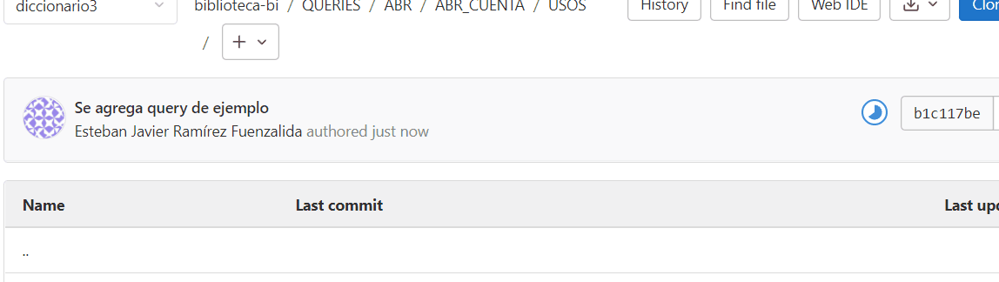

# Tutorial 

En este manual encontrarás indicaciones sobre el proceso de agregar, subir y borrar queries en el repositorio. Si eres un usuario con permisos de edición en la rama master, entonces puedes saltarte todo lo respectivo a hacer un *merge request*. 
**_¡Pero recuerda validar la query antes de agregarla!_**

---
## INDICE
---

- [Formato de queries](#formato-de-queries)
- [Agregar, modificar y eliminar queries](#agregar-modificar-y-eliminar-queries)
    - [Ubicar rama master](#rama-master)
    - [Posicionarte en el directorio](#ubicar-directorio)
        - [Navegar desde el repositorio](#nav-repo)
        - [Navegar desde el *README*](#nav-readme)
    - [Agregar archivo](#agregar-archivo)
        - [Nuevo archivo](#nuevo-archivo)
        - [Subir archivo](#subir-archivo)
    - [¿Cómo modificar una query?](#modificar-archivo)
    - [¿Cómo eliminar una query?](#eliminar-archivo)
    - [Revisar cambio en rama temporal](#revisar)
    - [¿Cómo hago un merge request?](#merge-request)
    - [¿Qué es el pipeline?](#pipeline)
    - [¿Cuanto demora el pipeline en actualizar el *README*?](#ver-pipeline)

---
## Formato de queries
---
Al momento de agregar una query es necesario que esta cumpla con cierto formato para que esta sea documentada correctamente en el *README*. El formato:
```sql
-- TÍTULO
/*
Descripción
*/
/*
Fecha de modificación
*/
/*
Modificacióm hecha
*/
SELECT 
*
FROM tabla
```

De no cumplir el formato anterior tu query no se agregara de forma correcta al *README*.

----
## Agregar, modificar y eliminar queries

---
### Ubicar la rama master <a name="rama-master"></a>
---
Para poder agregar una query y que se integre automáticamente al *README* tienes que pararte en la rama **master**:



---
### Posicionarte en el directorio<a name="ubicar-directorio"></a>
---
Luego, buscar el directorio donde quieres agregar una query. Para este ejemplo agregaremos una query a QUERIES\ABR\ABR_CUENTA\USOS.
Se puede navegar de dos formas:

#### 1. Navegar desde el repositorio:<a name="nav-repo"></a>



#### 2. Navegar desde el *README*:<a name="nav-readme"></a>



---
### Agregar archivo<a name="agregar-archivo"></a>
---
Una vez dentro del directorio en el que deseas agregar la query hacer click en el selector '+' al lado de la ruta del directorio, donde tendrás 2 opciones para agregar archivos: new file y upload file.

#### 1. Nuevo archivo<a name="nuevo-archivo"></a>
Si seleccionas *New file* se abrirá un formulario donde tendrás que agregar el nombre de la query (con extensión .sql) y el contenido de la misma:



Tal como en el ejemplo, al hacer el commit debes deseleccionar la opción *Start a new merge request with these changes*. Así podrás revisar en la rama temporal, que es creada automáticamente, si la query fue agregada de forma correcta y se visualiza sin errores.

#### 2. Subir archivo<a name="subir-archivo"></a>
Si seleccionas * Upload file* se abrirá una ventana donde puedes arrastrar o buscar el archivo que quieres subir:



Tal como en el ejemplo anterior, al hacer el commit debes deseleccionar la opción *Start a new merge request with these changes*. Así podrás revisar en la rama temporal, que es creada automáticamente, si la query fue agregada de forma correcta y se visualiza sin errores.

---
## ¿Cómo modificar una query?<a name="modificar-archivo"></a>
---

Para modificar una query solo basta ubicar la query que quieres modificar, *Edit*, hacer click en la opción *editar*, hacer los cambios y hacer un commit:



Tal como en el ejemplo anterior, al hacer el commit debes deseleccionar la opción *Start a new merge request with these changes*. Así podrás revisar en la rama temporal, que es creada automáticamente, si la query fue modificada de forma correcta y se visualiza sin errores.

---
## ¿Cómo eliminar una query?<a name="eliminar-archivo"></a>
---

Para eliminar query debes ubicar la query que quieres eliminar y hacer click en *Delete*:



Tal como en el ejemplo anterior, al hacer el commit debes deseleccionar la opción *Start a new merge request with these changes*. Así podrás revisar en la rama temporal, que es creada automáticamente, si la query fue eliminada de forma correcta.

---
## Revisar cambio en rama temporal<a name="revisar"></a>
---
Como pudiste notar en los ejemplos anteriores, cada cambio realizado en la rama *master* no se hace directamente en ella, si no que se crea una *Target branch* automáticamente donde se van a llevar a cabo los cambios. Esta nueva rama es una copia de la rama *master* que incluye tus cambios. 
Luego de realizar cualquier acción, presta atención al nombre de la Target branch* que aparece en el commit, posicionate en ella y verifica que el cambio se hizo de forma correcta, que la query haya sido agregada, modificada o eliminada de forma correcta.

En caso de tener errores al subir tu query, verifica que el formato cumpla el estándar solicitado. Si ese no es el problema entonces estás siendo víctima de un bug de GitLab, en ese caso, realiza la acción de nuevo con la esperanza de que esta vez si funcione.

Si compruebas que los cambios se efectuaron de forma correcta, entonces es hora de agregarlo a la rama *master* mediante un *merge request*

---
## ¿Cómo hago un merge request?<a name="merge-request"></a>
---
Para esto debes estar en la rama temporal creada al hacer el commit. El mismo GitLab te va a sugerir hacer un merge request. Debes hacer click en esa opción, verificar que sea un merge de la rama temporal a la rama *master*, asignar la aprobación y el merge al encargado o la encargada de la carpeta que estás editando (en el siguiente ejemplo asignamos los cambios a Cristóbal Gallardo):



Al hacer el merge request debes dejar seleccionada la opcion *Delete source branch when merge request is accepted*, así al momento de aceptar el merge se podrá borrar la rama temporal. Luego de hacer el procedimiento antes mencionado, avisa a quien asignaste el merge la acción que acabas de realizar para que revise y apruebe el merge request.

---
## ¿Cómo hago un merge ?<a id="merge"></a>
---

En la sección de merge request, en la barra lateral derecha, habrán tareas pendientes, si hay un merge asignado a tu nombre significa que debes revisar dichas solicitudes. En el siguiente ejemplo hay solicitudes asignadas a @cegallardo:


En el ejemplo anterior se pudo ver que el cambio hecho fue que se borró el archivo *query_prueba2.sql*.
Una vez confirmado el cambio, puedo hacer el merge:



---
## ¿Qué es el pipeline?<a name="pipeline"></a>
---
Es un proceso que se ejecuta cada vez que se hace un cambio en cualquier rama del repositorio. En particular, en este repositorio el pipeline ejecuta un código en python que agrega tus cambios de forma automática al *README*.

---
## ¿Cuanto demora el pipeline en actualizar el *README*?<a name="ver-pipeline"></a>
---
El pipeline se demora unos segundos en actualizarse, para estar seguros de cuándo los cambios se ven reflejados en el *README* podemos ver la barra de ejecución del pipeline luego de realizar alguno de los cambios mencionados anteriormente:



Como se muestra en el ejemplo, luego de subir un cambio el mensaje del pipeline pasa por distintos estados: 
- Está pausado mientras el pipeline 'se prepara' para correr el proceso.
- Comienza a correr el proceso.
- El proceso se ejecuta correctamente.
- Se muestra un mensaje comentando que el *README* se actualizó de forma automática.

Si ves el último mensaje, entonces podrás ver en el *README* el cambio realizado.


